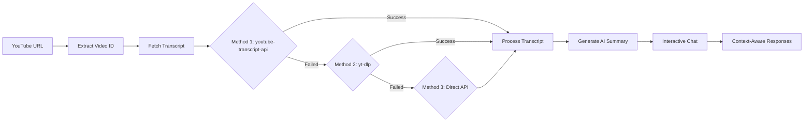
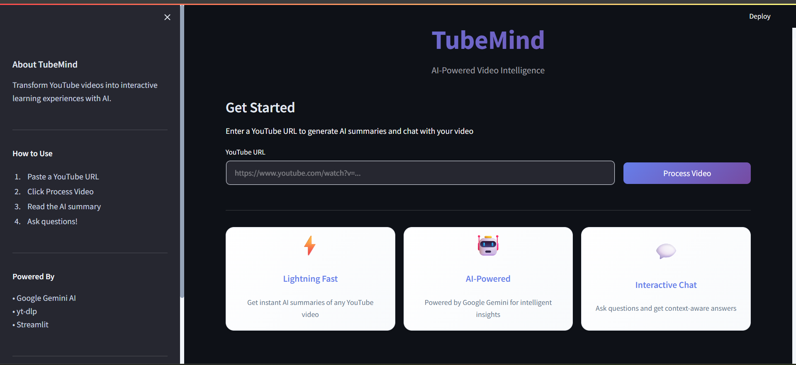
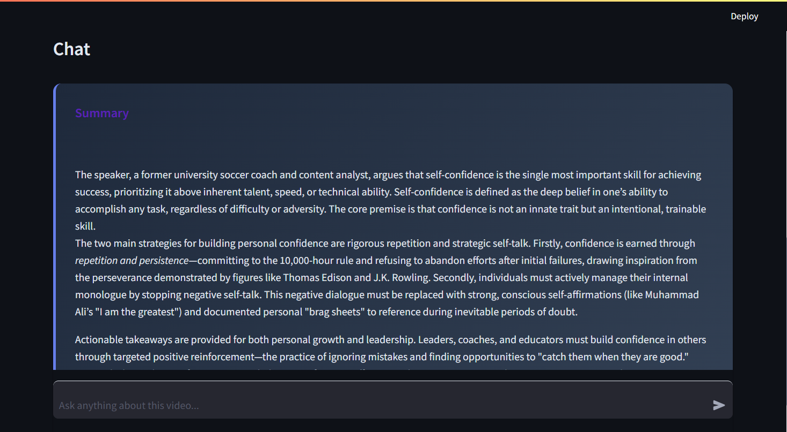
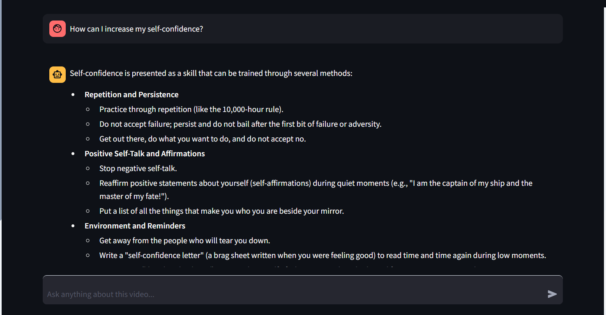

# 📺 TubeMind: AI-Powered YouTube Video Assistant

> **Turn any YouTube video into an interactive conversation.**
> *Built with Python, Streamlit, and Google Gemini AI.*

[](https://www.python.org/)
[](https://streamlit.io/)
[](https://ai.google.dev/)
[](https://opensource.org/licenses/MIT)

---

## 📖 Overview

**TubeMind** is an intelligent AI application that solves the problem of information overload from YouTube videos. Instead of watching hour-long videos to find specific information, TubeMind allows you to:

1. 📌 **Paste** a YouTube link
2. ⚡ **Get** an instant AI-generated summary
3. 💬 **Chat** with the video content to extract specific insights

This project demonstrates the practical application of **LLMs (Large Language Models)** and **RAG (Retrieval-Augmented Generation)** concepts, making video content searchable and conversational.

### 🎯 Perfect For

- 🎓 **Students** - Quickly understand educational content
- 💼 **Professionals** - Extract key points from webinars and tutorials
- 📚 **Researchers** - Analyze video content without watching hours of footage
- 🌐 **Content Creators** - Study competitor videos efficiently

## ✨ Key Features

* **🎬 Video Processing:** Instantly fetches video transcripts using the YouTube API.
* **📝 Auto-Summarization:** Generates a concise executive summary of the video content upon loading.
* **💬 Interactive Q&A:** Ask questions like *"What is the main argument?"* or *"What tools were mentioned?"* and get answers based strictly on the video context.
* **⚡ Fast & Lightweight:** Built with Streamlit for a responsive, no-clutter UI.
* **🎨 Modern UI:** Clean, intuitive interface with custom styling.
* **💾 Session Management:** Maintains chat history and context throughout your session.

## 🛠️ Tech Stack

* **Frontend:** [Streamlit](https://streamlit.io/) (for rapid UI development)
* **LLM Engine:** [Google Gemini Pro](https://ai.google.dev/) (via `google-generativeai`)
* **Data Ingestion:** 
  - `youtube-transcript-api` (primary method)
  - `yt-dlp` (fallback method)
  - `requests` (HTTP handling)
* **Environment Management:** `python-dotenv`

## 🚀 Quick Start

### Prerequisites

- Python 3.10 or higher
- A Google API Key (free from [Google AI Studio](https://aistudio.google.com/apikey))

### Installation

1. **Clone the repository:**
   ```bash
   git clone https://github.com/yourusername/tubemind.git
   cd tubemind
   ```

2. **Create a virtual environment (recommended):**
   ```bash
   # Windows
   python -m venv venv
   venv\Scripts\activate

   # macOS/Linux
   python -m venv venv
   source venv/bin/activate
   ```

3. **Install dependencies:**
   ```bash
   pip install -r requirements.txt
   ```

4. **Set up Environment Variables:**
   
   Create a `.env` file in the root directory:
   ```bash
   # Create .env file
   echo "GOOGLE_API_KEY=your_actual_api_key_here" > .env
   ```
   
   Or manually create a `.env` file with:
   ```
   GOOGLE_API_KEY=your_actual_api_key_here
   ```
   
   📌 **Get your free API key from:** [Google AI Studio](https://aistudio.google.com/apikey)

5. **Run the App:**
   ```bash
   streamlit run app.py
   ```

6. **Access the app:**
   - The app will automatically open in your browser at `http://localhost:8501`
   - Or manually navigate to: `http://localhost:8501`

## 🧠 How It Works



### Technical Flow

1. 🔍 **URL Processing** - Extracts the video ID from various YouTube URL formats
2. 📥 **Multi-Method Transcript Fetching** - Uses 3 fallback methods:
   - **Method 1:** `youtube-transcript-api` - Fast and reliable
   - **Method 2:** `yt-dlp` - Enhanced settings for difficult videos
   - **Method 3:** Direct Timedtext API - Last resort scraping
3. 🤖 **AI Processing** - Feeds transcript to Google Gemini Flash with optimized prompts
4. 💾 **Smart Caching** - Stores transcripts in session for instant re-access
5. 💬 **Contextual Chat** - Maintains conversation history for intelligent follow-ups

## 💡 Usage Tips

* **Best Results:** Works best with videos that have accurate captions/subtitles.
* **Language Support:** Currently optimized for English content.
* **Video Length:** Can handle videos of any length, but longer videos may take slightly longer to process.
* **Questions:** Ask specific questions for better answers (e.g., "What are the 3 main arguments?" vs "Tell me about this").

## 🔍 Troubleshooting

### HTTP 429 Error (Rate Limit) ⚠️
If you encounter a **"Too Many Requests"** error:

**What's happening:**
- YouTube limits subtitle requests per IP address
- Too many requests trigger a temporary block (15-30 minutes)

**Solutions:**

1. **Wait it out (Recommended)** ⏰
   - Wait 15-30 minutes for the rate limit to reset
   - Use the test script to check if it's cleared:
     ```bash
     python test_transcript.py rNxC16mlO60
     ```

2. **The app tries 3 different methods automatically:**
   - Method 1: YouTube Transcript API
   - Method 2: Direct Timedtext API scraping
   - Method 3: Enhanced yt-dlp
   
3. **Test with a different video** 🎬
   - Try a different video to confirm the app works
   - If other videos work, the issue is with that specific video

4. **Best practices to avoid rate limits:**
   - Don't process multiple videos rapidly
   - Use the cached versions (instant reload)
   - Wait a few seconds between different videos

### No Subtitles Available
* Not all videos have subtitles/captions enabled
* Try a different video with confirmed captions
* Look for the "CC" icon on YouTube to verify caption availability

### Video Not Found / Private Video
* Ensure the video is public and not age-restricted
* Check that the URL is correct and the video hasn't been deleted

## 📸 Screenshots

### Welcome Screen

*Clean, modern interface with feature highlights*

### Video Summary

*Instant AI-generated summary of video content*

### Interactive Chat

*Ask questions and get intelligent answers based on video content*

---

### ✨ Key Features in Action

- 🎥 **Embedded video player** - Watch while you chat
- 📝 **AI-generated summary** - Get the gist instantly  
- 💬 **Interactive Q&A** - Extract specific insights
- 📊 **Session statistics** - Track your usage

### 💬 Sample Questions to Try

- 🎯 "What is the main argument of this video?"
- 📊 "List the key statistics mentioned"
- 🔧 "What tools or technologies were discussed?"
- 💡 "What are the actionable takeaways?"
- ⏰ "How long should this process take according to the video?"

## 🔧 Project Structure

```
tubemind/
│
├── app.py                      # Main Streamlit application (964 lines)
│   ├── Video ID extraction
│   ├── Multi-method transcript fetching
│   ├── AI summary generation
│   ├── Interactive chat system
│   └── Modern UI with custom CSS
│
├── test_transcript.py          # Test script for transcript fetching
├── check_models.py             # Check available Gemini models
├── requirements.txt            # Python dependencies
├── .env                        # Your API keys (gitignored)
├── .gitignore                  # Git ignore rules
└── README.md                   # Documentation
```

### Key Files

| File | Purpose | Lines |
|------|---------|-------|
| `app.py` | Main application with UI and AI logic | 964 |
| `test_transcript.py` | Testing utility for transcript fetching | 155 |
| `check_models.py` | Verify Gemini API models | 35 |
| `requirements.txt` | Python package dependencies | 6 |

## 🧪 Testing

Use the test script to check if transcript fetching works without starting the full app:

```bash
# Test with default video
python test_transcript.py

# Test with specific video ID
python test_transcript.py VIDEO_ID_HERE

# Example
python test_transcript.py dQw4w9WgXcQ
```

This is useful for:
- Checking if rate limits have cleared
- Testing video accessibility before using the full app
- Quick debugging

## 🤝 Contributing

Contributions are welcome! Here's how you can help:

1. 🍴 Fork the repository
2. 🌿 Create your feature branch (`git checkout -b feature/AmazingFeature`)
3. 💾 Commit your changes (`git commit -m 'Add some AmazingFeature'`)
4. 📤 Push to the branch (`git push origin feature/AmazingFeature`)
5. 🔃 Open a Pull Request

### Areas for Contribution

- 🌍 Multi-language support
- 📊 Export functionality (PDF, Markdown)
- ⏰ Timestamp integration in responses
- 🎨 UI/UX improvements
- 🐛 Bug fixes and optimizations

## 📝 License

This project is licensed under the **MIT License** - see below for details:

```
MIT License

Copyright (c) 2025 Mert Toprak

Permission is hereby granted, free of charge, to any person obtaining a copy
of this software and associated documentation files (the "Software"), to deal
in the Software without restriction, including without limitation the rights
to use, copy, modify, merge, publish, distribute, sublicense, and/or sell
copies of the Software, and to permit persons to whom the Software is
furnished to do so, subject to the following conditions:

The above copyright notice and this permission notice shall be included in all
copies or substantial portions of the Software.

THE SOFTWARE IS PROVIDED "AS IS", WITHOUT WARRANTY OF ANY KIND, EXPRESS OR
IMPLIED, INCLUDING BUT NOT LIMITED TO THE WARRANTIES OF MERCHANTABILITY,
FITNESS FOR A PARTICULAR PURPOSE AND NONINFRINGEMENT. IN NO EVENT SHALL THE
AUTHORS OR COPYRIGHT HOLDERS BE LIABLE FOR ANY CLAIM, DAMAGES OR OTHER
LIABILITY, WHETHER IN AN ACTION OF CONTRACT, TORT OR OTHERWISE, ARISING FROM,
OUT OF OR IN CONNECTION WITH THE SOFTWARE OR THE USE OR OTHER DEALINGS IN THE
SOFTWARE.
```
```

## 🙏 Acknowledgments

* [Streamlit](https://streamlit.io/) for the amazing web framework
* [Google Gemini](https://ai.google.dev/) for the powerful AI model
* [YouTube Transcript API](https://github.com/jdepoix/youtube-transcript-api) for easy transcript access
* [yt-dlp](https://github.com/yt-dlp/yt-dlp) for reliable video processing

## 📧 Contact & Support

**Mert Toprak**
- 💼 LinkedIn: [Mert Toprak](https://www.linkedin.com/in/merttoprak/)


<div align="center">

**⭐ Star this repository if you find it helpful!**

*Developed with ❤️ by [Mert Toprak](https://github.com/merttoprak1)*

*A portfolio project demonstrating practical applications of LLMs and AI in solving real-world problems*

[](https://www.python.org/)
[](https://ai.google.dev/)
[](https://streamlit.io/)

</div>
